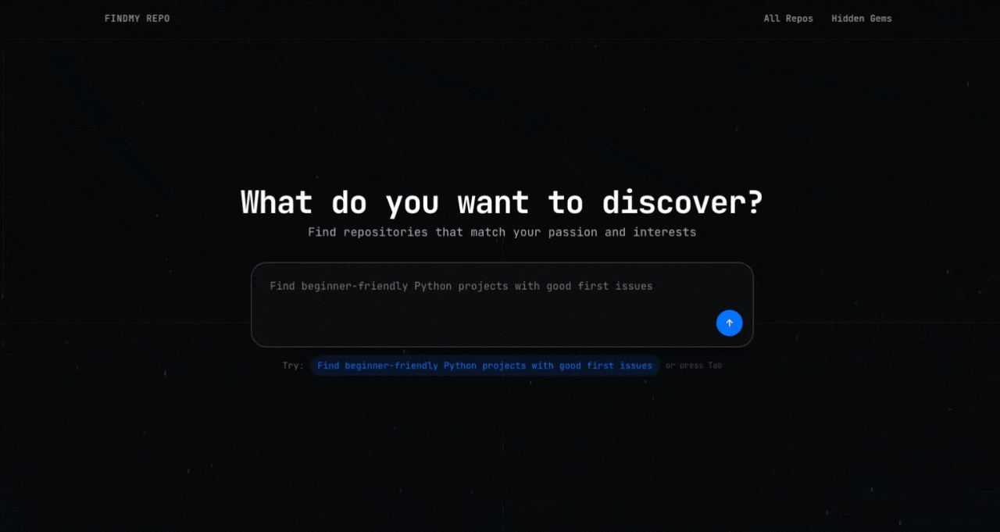

<div align="center">

# 🔎 FindMyRepo

[](https://github.com/Abhinavbajpai30/FindMyRepo/actions/workflows/ci.yml)


**An AI-assisted platform for discovering open-source GitHub repositories through semantic natural language search.**

</div>

---

## 📽️ See it in Action

<div align="center">
  
</div>

<br />

FindMyRepo moves beyond simple keyword matching. By leveraging **Gemini AI** and **Weaviate Vector DB**, we translate natural language queries into complex hybrid searches—allowing you to discover hidden gems, match exact constraints, and surface the most relevant repositories instantly.

---

## ✨ Core Features

- 🧠 **Natural Language Search:** Describe what you're looking for natively, and the AI translates it to executable database constraints.
- ⚡ **Hybrid Retrieval:** Blends state-of-the-art vector similarity (semantic meaning) with strict metadata filters (e.g., number of stars, forks, language).
- 💎 **Hidden Gems:** A dedicated module for highlighting highly underrated, lesser-known projects you won't find on regular trending pages.
- 🎯 **Personalized Recommendations:** Get repository suggestions tuned to your developer profile, role, and onboarding preferences.
- 🧭 **Advanced Filtering:** Intuitive UI for combining paginated catalogs and hard constraint filters.

---

## 🏗 System Architecture & Decisions

<div align="center">
  
</div>

<br />

### Engineering Trade-offs & Decisions

*   **Weaviate as the Vector DB (Hybrid Search):** 
    We selected Weaviate Cloud to fuse raw vector search (semantic retrieval) with exact BM25 metadata filtering. This overcomes the limitations of traditional DBs by allowing users to query using natural language while still preserving mandatory hard filters like `language=python` or `stars > 500`.
*   **`all-MiniLM-L6-v2` Embeddings:** 
    We chose this specific sentence-transformers model to ensure high-efficiency, low-latency text embeddings. It runs easily on local environments and standard Docker setups without necessitating expensive cloud GPU constraints.
*   **Gemini AI Query Parsing:** 
    By leveraging Google's Gemini Flash model dynamically, we translate unstructured user-intent directly into Python Weaviate queries. This acts as an intelligent intermediary that seamlessly handles complex, nested logical parsing that static heuristics simply cannot match.

---

## 💻 Tech Stack

| Component         | Technology Used                                                                            |
| ----------------- | ------------------------------------------------------------------------------------------ |
| **Frontend**      | React, TypeScript, Vite, Tailwind CSS, shadcn/ui                                           |
| **Backend**       | FastAPI, Pydantic, Weaviate Python Client, Google GenAI SDK                                |
| **Data/AI Layer** | Weaviate Cloud, `sentence-transformers` (`all-MiniLM-L6-v2`), Gemini AI                    |
| **Infrastructure**| Docker & Docker Compose                                                                    |

---

## 📂 Project Structure

```text
FindMyRepo/
├── backend/            # FastAPI microservice
├── frontend/           # React + Vite client application
├── dataset_test/       # Dataset preparation & exploration utilities
├── data/               # Persistent data storage (e.g., enriched GitHub repos JSON)
└── scripts/            # Database ingestion and utility scripts (e.g., push_to_db.py)
```

---

## 🚀 Getting Started

### 📋 Prerequisites

- Python 3.11+
- Node.js 18+ (Node 20 recommended)
- Weaviate Cloud cluster URL and API key
- Google Gemini API key

### ⚙️ Environment Configuration

Use the provided `.env.example` templates strategically across the project. 

<details>
<summary><b>1. Root <code>.env</code> (For Data Ingestion Scripts)</b></summary>

```env
WEAVIATE_API_KEY=your_weaviate_api_key
WEAVIATE_URL=https://your-weaviate-cluster.weaviate.network
```
</details>

<details>
<summary><b>2. Backend <code>backend/.env</code></b></summary>

```env
GEMINI_API_KEY=your_gemini_api_key
WEAVIATE_API_KEY=your_weaviate_api_key
WEAVIATE_URL=https://your-weaviate-cluster.weaviate.network
```
</details>

<details>
<summary><b>3. Frontend <code>frontend/.env</code></b></summary>

```env
VITE_API_BASE_URL=http://localhost:8000
VITE_SEARCH_API_URL=http://localhost:8000/search
VITE_USER_PREFERENCES_API=http://localhost:8000/userpreferences
VITE_ALL_REPOS_ENDPOINT=/allrepos
VITE_HIDDEN_GEMS_ENDPOINT=/hiddengem
```
</details>

<br/>

### 🐳 Run with Docker (Recommended)

This repository includes a fully-configured Dockerized setup with compatible runtime environments.

```bash
# Start all services
docker compose up --build

# Access:
# - Frontend: http://localhost:8080
# - Backend API: http://localhost:8000

# Tear down
docker compose down
```

*(Optional)* You can override Docker frontend endpoints by copying `.env.docker.example` to `.env.docker` and executing: `docker compose --env-file .env.docker up --build`

### 💻 Local Development Setup

<details>
<summary><b>Running the Backend</b></summary>

```bash
cd backend
python -m venv .venv
source .venv/bin/activate   # Windows: .venv\Scripts\activate
pip install -r requirements.txt
uvicorn main:app --host 0.0.0.0 --port 8000 --reload
```
Health Check: `GET http://localhost:8000/health`
</details>

<details>
<summary><b>Running the Frontend</b></summary>

```bash
cd frontend
npm install
npm run dev
```
Client URL: `http://localhost:8080`
</details>

---

## 📥 Data Ingestion

To populate your Weaviate Cloud cluster with the GitHub repository catalog:

```bash
python scripts/push_to_db.py
```

**How it works:**
1. Connects to Weaviate via your `WEAVIATE_URL`.
2. Seamlessly recreates the `Repos` collection.
3. Automatically generates semantic embeddings using `all-MiniLM-L6-v2`.
4. Batch inserts all enriched records directly from the `data/` directory.

---

## 🌐 API Overview

| Endpoint | Method | Description |
| :--- | :---: | :--- |
| `/search` | `POST` | Execute natural language semantic repository search. |
| `/userpreferences` | `POST` | Generate tailored repository recommendations from onboarding profiles. |
| `/allrepos` | `GET` | Fetch the paginated repository catalog with granular hard bounds. |
| `/hiddengem` | `GET` | Surface underrated repository paginated results. |
| `/example-queries` | `GET` | Retrieve valid sample prompts. |

---

## ☁️ Deployment Guidelines

<details>
<summary><b>Backend (Railway, Render, etc.)</b></summary>

- Set Root Directory: `backend/`
- Build CMD: `pip install -r requirements.txt`
- Start CMD: `bash start.sh` (Required to map to platform-provided `$PORT`)
- Remember to inject your `GEMINI_API_KEY`, `WEAVIATE_API_KEY`, and `WEAVIATE_URL` environment variables.
</details>

<details>
<summary><b>Frontend (Vercel, Netlify)</b></summary>

- Set Root Directory: `frontend/`
- Build CMD: `npm run build`
- Output Dir: `dist`
- Configure `frontend/vercel.json` SPA rewrites and environment variables to route to your production backend.
</details>

---

## 🛡️ Production & Security Considerations

- **Restrict CORS:** Limit origins in `backend/main.py` explicitly to your frontend domain payload in production.
- **Secrets Management:** Treat all API keys strictly as secrets securely stored in environmental key vaults.
- **Review Vector Executions:** Periodically sanitize and review generated-query patterns before wide-scale public exposure to prevent abuse.

<br />

---
<div align="center">
  <sub>Built with ❤️ by Abhinavbajpai30 and AI Assistant </sub>
</div>
